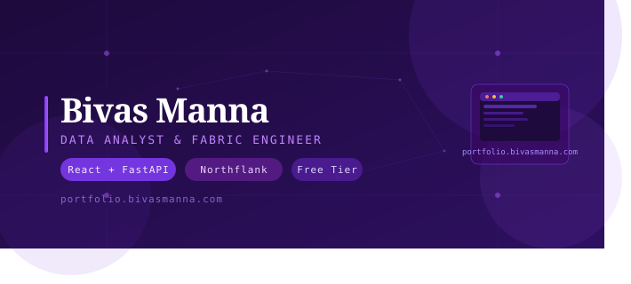
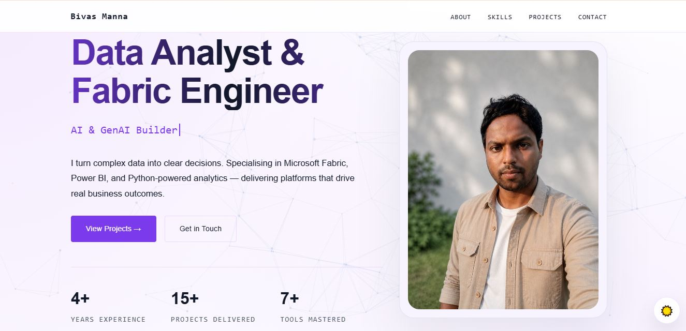
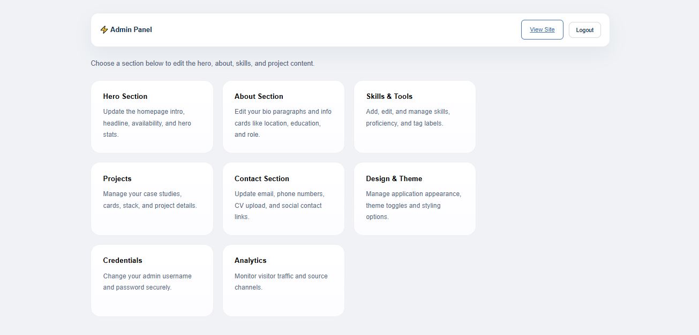
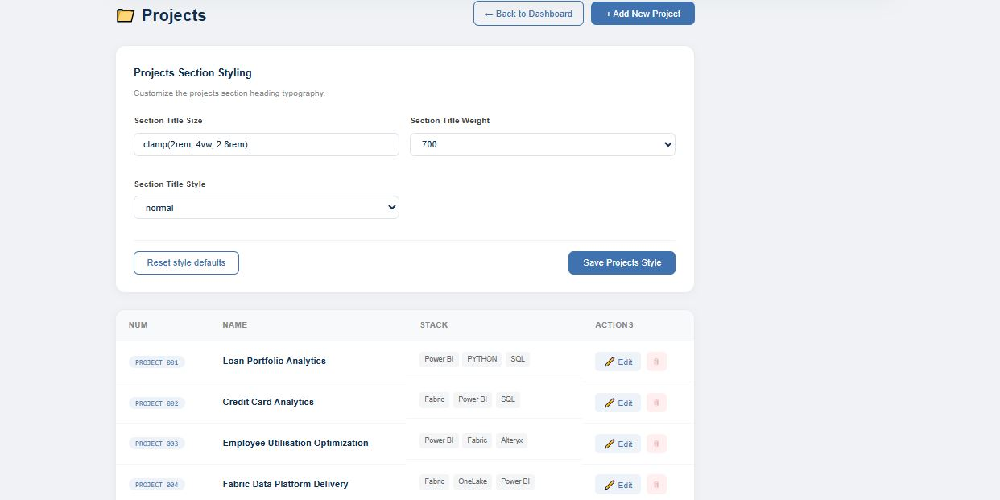
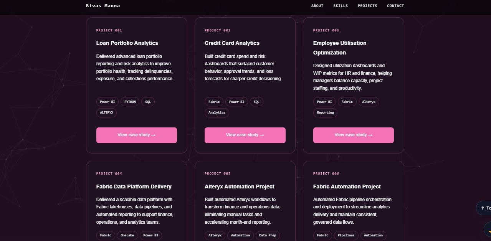
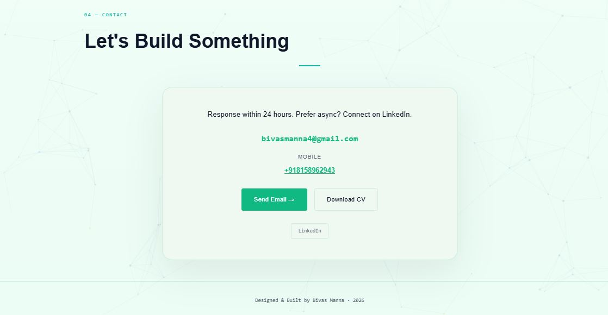

# 🚀 Portfolio Deployment Guide
### React + FastAPI · Northflank · Custom Domain · Admin Panel · Free Hosting

<div align="center">



[](https://portfolio.bivasmanna.com)
[](https://vitejs.dev)
[](https://fastapi.tiangolo.com)
[](https://northflank.com)
[](https://northflank.com)

</div>

---

## 📸 Screenshots

<div align="center">

### 🖥️ Frontend — Hero Section


### ⚙️ Admin Panel — Dashboard


### 📊 Admin Panel — Edit Projects


### 🎨 Frontend — Projects Section


### 📬 Frontend — Contact Section


</div>

---

## 🧱 Architecture

| Component | Tech | Hosting |
|-----------|------|---------|
| 🎨 Frontend | React + Vite | Northflank (Free) |
| ⚙️ Backend | FastAPI + Python | Northflank (Free) |
| 🌐 Domain | Wix DNS | Custom CNAME |
| 📦 Repository | GitHub | CI/CD Auto-deploy |
| 🔒 SSL | Let's Encrypt | Auto via Northflank |

### Final URLs

| Service | URL |
|---------|-----|
| 🌐 Frontend | `https://portfolio.yourdomain.com` |
| ⚙️ Backend | `https://your-backend.code.run` |

---

## 📁 Project Structure

```
project/
│
├── frontend/
│   ├── src/
│   ├── index.html
│   ├── package.json
│   ├── vite.config.js
│   └── Dockerfile          ← do not modify
│
└── backend/
    ├── static/
    ├── data.json            ← editable content store
    ├── main.py
    ├── requirements.txt
    └── Dockerfile          ← do not modify
```

> ⚠️ **Do not modify the Dockerfiles.** CORS and allowed origins are pre-configured.

---

## 🛠️ Step-by-Step Deployment

### 1. Push to GitHub

```bash
# Initialize
git init
git add .
git commit -m "initial commit"

# Connect repo
git remote add origin https://github.com/USERNAME/REPO.git
git branch -M main
git push -u origin main
```

For future updates:
```bash
git add .
git commit -m "updated project"
git push origin main
```

---

### 2. Create Northflank Account

- Go to [northflank.com](https://northflank.com) and create a free account
- A credit card is required for verification (no charge)
- Go to **Integrations** → connect your GitHub repo

---

### 3. Create Project

- In Northflank dashboard → **Create Project** → name it `Portfolio`

---

### 4. Deploy Backend Service

1. Inside the project → **Add Service** → name it `backend`
2. Connect the same GitHub repo
3. Select the `backend/` folder
4. Choose **Docker** deployment
5. Set port to **8000**
6. Under **Environment Variables**, add:

```
ALLOWED_ORIGINS=*
```

7. Click **Build & Deploy**

---

### 5. Deploy Frontend Service

1. Inside the project → **Add Service** → name it `frontend`
2. Connect the same GitHub repo
3. Select the `frontend/` folder
4. Choose **Docker** deployment
5. Set port to **80**
6. Under **Build Variables**, add:

```
VITE_API_URL=https://your-backend.code.run
```

> ⚠️ No trailing `/` in the URL. Rebuild frontend after any env variable changes.

7. Click **Build & Deploy**

---

### 6. Buy a Domain (Wix)

- Purchase your domain from [wix.com/domains](https://wix.com/domains)
- Recommended: `yourname.com` (~$1–10/year)
- No changes needed immediately after purchase

---

### 7. Add Custom Domain in Northflank

1. Northflank → **Domains** (top nav) → **New domain grouping**
2. Enter FQDN: `portfolio.yourdomain.com`
3. Northflank will show a **CNAME verification record**

---

### 8. Add CNAME in Wix DNS

Go to **Wix → Domains → DNS Records → CNAME → Add Record**

| Field | Value |
|-------|-------|
| Host name | `portfolio` |
| Value | `portfolio.yourdomain.com.blkp-xxxx.dns.northflank.app` |
| TTL | 1 Hour |

> ⚠️ Always use **CNAME**, never A record for subdomains.

---

### 9. Verify & Link Service

1. Back in Northflank → click **Verify subdomain**
2. Once verified, set:

| Field | Value |
|-------|-------|
| Project | Portfolio |
| Service | frontend |
| Port | HTTP : 80 |

3. Click **Update**

---

### 10. SSL Certificate

Northflank automatically generates a **Let's Encrypt HTTPS certificate**.

Status flow:
```
Not verified → Verified → Generating certificate → Certificate active ✅
```

Takes ~1–2 minutes. Your site will be live at `https://portfolio.yourdomain.com` 🎉

---

## 🔄 Auto Deployment

Every push to `main` automatically redeploys both services:

```bash
git add .
git commit -m "updated ui"
git push origin main
# ✅ Live at portfolio.yourdomain.com in ~2 minutes
```

---

## 🐛 Common Problems & Fixes

| Problem | Cause | Fix |
|---------|-------|-----|
| `ERR_CONNECTION_REFUSED` | Frontend calling `localhost` | Set `VITE_API_URL` env variable |
| CORS Error | Frontend domain not whitelisted | Update `ALLOWED_ORIGINS` in backend env |
| Images not loading | Localhost image URLs saved in DB | Use dynamic request-based URLs |
| Frontend using old env | Vite uses build-time env | Full rebuild, not just restart |

---

## 🗑️ How to Remove the Custom Domain

To fully unlink `portfolio.yourdomain.com`:

1. **Northflank** → Domains → delete the domain grouping
2. **Wix** → DNS → CNAME section → delete the `portfolio` record

> The frontend service itself is unaffected. You can re-link a domain anytime.

---

## ✨ Features

- 🎨 **Fully customizable** — every section editable via admin panel
- 👔 **Works for any profession** — not just developers
- 🔒 **HTTPS included** — automatic SSL via Let's Encrypt
- 💸 **100% free** — Northflank free tier + free GitHub CI/CD
- ⚡ **Auto-deploy** — push to GitHub, site updates automatically
- 🛡️ **Admin panel** — edit projects, skills, bio without touching code

---

<div align="center">

Made with ☕ by **Bivas Manna**

[](https://portfolio.bivasmanna.com)

</div>